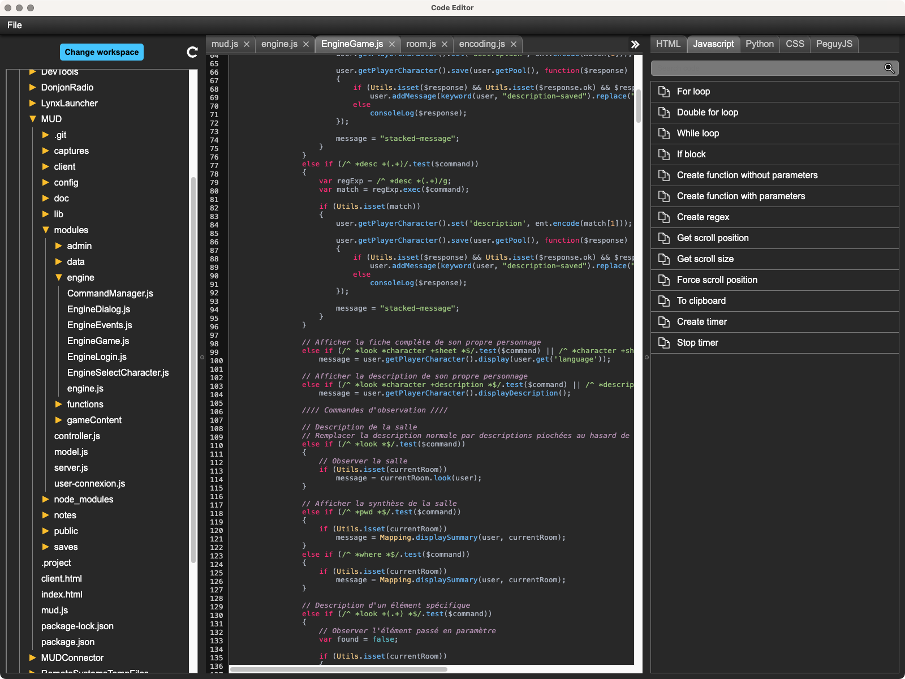
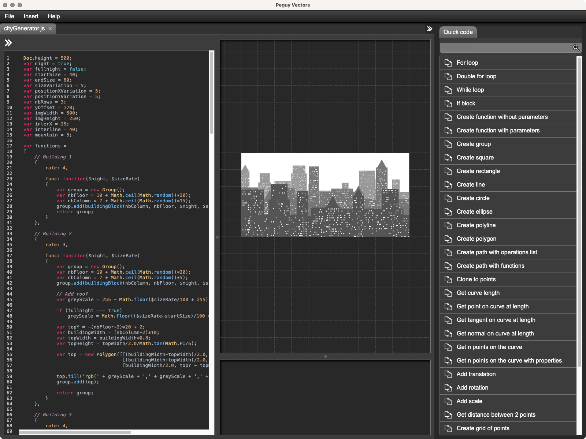
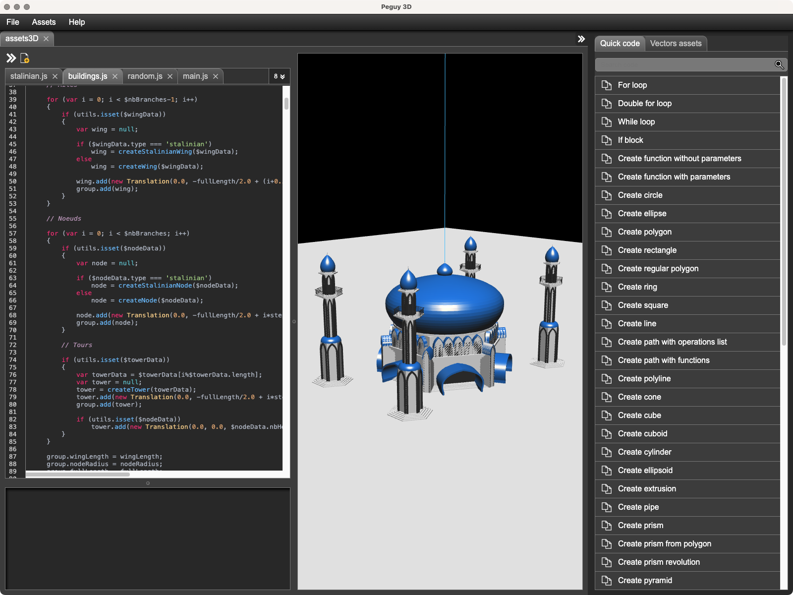
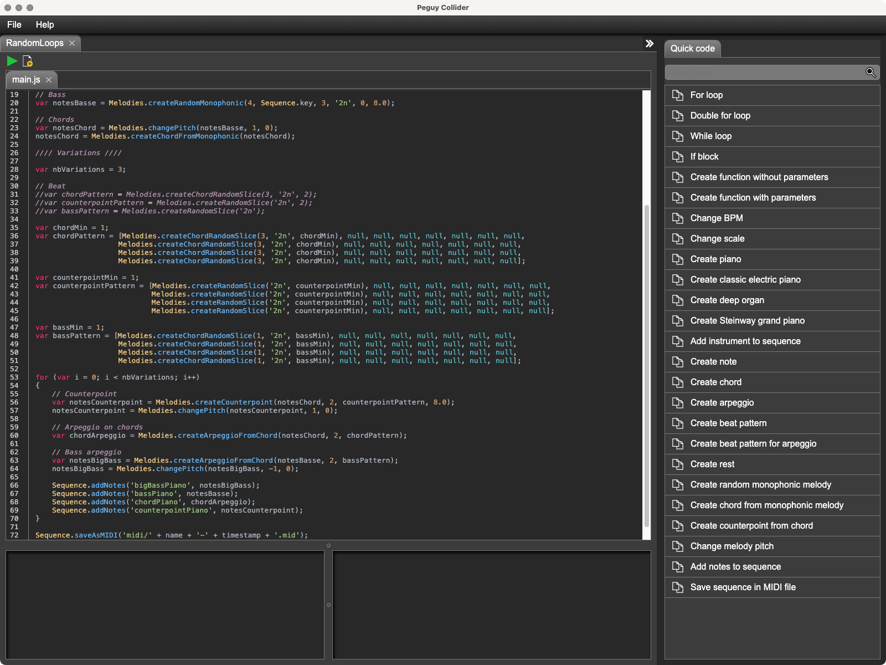
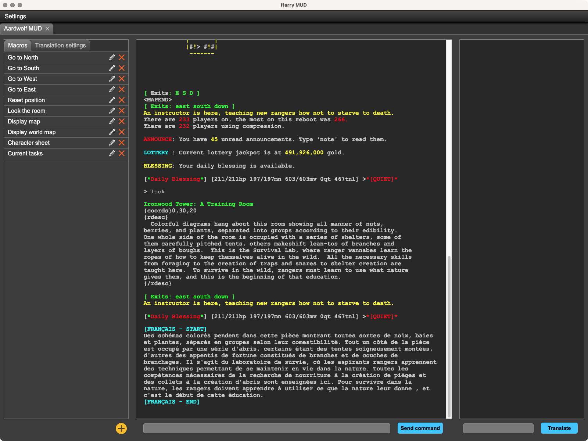

# Péguy.js

Péguy.js is a [Qt](https://www.qt.io/) inspired framework for complex graphic user interfaces development in Javascript.
It provides a set of ready-to-use components and allows you to create your own.

The documentation is available on the [Wiki](https://github.com/Killfaeh/Peguy.js/wiki).

## Examples of project developped with Péguy.js

[Péguy Editor](https://github.com/Killfaeh/PeguyEditor) is a small code editor offering a customizable library of ready-to-use code blocks to write code quickly.

[Péguy Vectors](https://github.com/Killfaeh/PeguyVectors) is a vector procedural generation software.

[Péguy 3D](https://github.com/Killfaeh/Peguy3D) is a 3D procedural generation software.

[Péguy Collider](https://github.com/Killfaeh/PeguyCollider) is a music procedural generation software.

[Harry MUD](https://github.com/Killfaeh/HarryMUD) is an interface to connect to your favorite MUDs. 

Péguy Diffuser
